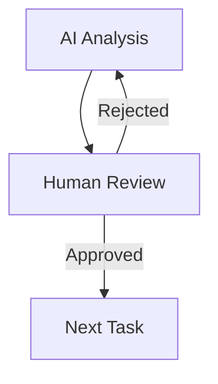
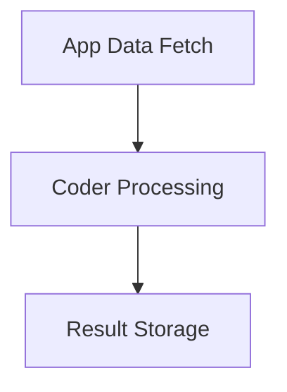

# Task Examples

## Overview

This guide provides practical examples of task configurations for common use cases. Each example includes complete configuration and explanation.

## Content Review Workflow

### 1. Generate Content (AI Task)
```json
{
  "type": "TASK",
  "block": {
    "name": "Generate Blog Post",
    "instructions": "Generate a blog post about the provided topic following brand guidelines",
    "input_parameters": [
      {
        "name": "topic",
        "type": "STRING",
        "description": "Blog post topic",
        "required": true,
        "source": "task_config"
      },
      {
        "name": "tone",
        "type": "STRING",
        "description": "Writing tone",
        "required": true,
        "source": "task_config"
      },
      {
        "name": "word_count",
        "type": "INTEGER",
        "description": "Target word count",
        "required": true,
        "source": "task_config"
      }
    ],
    "expected_output": [
      {
        "name": "content",
        "type": "STRING",
        "description": "Generated blog post content"
      }
    ]
  }
}
```

### 2. Review Content (Human Task)
```json
{
  "type": "HUMAN_TASK",
  "block": {
    "name": "Review Blog Post",
    "instructions": "Review the generated blog post for quality, accuracy, and brand alignment",
    "dependencies": ["Generate Blog Post"]
  }
}
```

### 3. Format Document (App Task)
```json
{
  "type": "APP_TASK",
  "block": {
    "name": "Create PDF",
    "provider": "pdf",
    "tool_name": "writer",
    "tool_id": 12,
    "input_parameters": [
      {
        "name": "content",
        "type": "STRING",
        "description": "Blog post content",
        "required": true,
        "source": "task_config"
      },
      {
        "name": "template",
        "type": "STRING",
        "description": "PDF template",
        "required": true,
        "source": "task_config"
      }
    ],
    "expected_output": [
      {
        "name": "pdf_url",
        "type": "STRING",
        "description": "URL of the generated PDF"
      }
    ],
    "dependencies": ["Review Blog Post"]
  }
}
```

## Data Processing Workflow

### 1. Process Data (Coder Task)
```json
{
  "type": "CODER",
  "block": {
    "name": "Process CSV Data",
    "code_artifact_id": 123,
    "input_parameters": [
      {
        "name": "csv_data",
        "type": "ARRAY",
        "description": "Raw CSV data",
        "required": true,
        "source": "task_config"
      },
      {
        "name": "processing_rules",
        "type": "OBJECT",
        "description": "Data processing rules",
        "required": true,
        "properties": [
          {
            "name": "columns",
            "type": "ARRAY",
            "description": "Columns to process"
          },
          {
            "name": "aggregation",
            "type": "STRING",
            "description": "Aggregation method"
          }
        ]
      }
    ],
    "expected_output": [
      {
        "name": "processed_data",
        "type": "ARRAY",
        "description": "Processed data"
      }
    ]
  }
}
```

### 2. Validate Results (AI Task)
```json
{
  "type": "TASK",
  "block": {
    "name": "Validate Data",
    "instructions": "Analyze the processed data for anomalies and validation issues",
    "input_parameters": [
      {
        "name": "data",
        "type": "ARRAY",
        "description": "Processed data to validate",
        "required": true
      }
    ],
    "expected_output": [
      {
        "name": "validation_result",
        "type": "OBJECT",
        "properties": {
          "is_valid": "BOOLEAN",
          "issues": "ARRAY",
          "recommendations": "ARRAY"
        }
      }
    ],
    "dependencies": ["Process CSV Data"]
  }
}
```

### 3. Review Results (Human Task)
```json
{
  "type": "HUMAN_TASK",
  "block": {
    "name": "Review Results",
    "instructions": "Review the processed data and validation results. Approve if accurate or reject for reprocessing.",
    "dependencies": ["Validate Data"]
  }
}
```

## Document Generation Workflow

### 1. Gather Data (App Task)
```json
{
  "type": "APP_TASK",
  "block": {
    "name": "Fetch Data",
    "provider": "database",
    "tool_name": "query_executor",
    "tool_id": 34,
    "input_parameters": [
      {
        "name": "query_params",
        "type": "OBJECT",
        "description": "Query parameters",
        "required": true
      }
    ],
    "expected_output": [
      {
        "name": "query_results",
        "type": "ARRAY",
        "description": "Query results"
      }
    ]
  }
}
```

### 2. Generate Report (Coder Task)
```json
{
  "type": "CODER",
  "block": {
    "name": "Generate Report",
    "code_artifact_id": 456,
    "input_parameters": [
      {
        "name": "data",
        "type": "ARRAY",
        "description": "Report data",
        "required": true
      },
      {
        "name": "template",
        "type": "STRING",
        "description": "Report template",
        "required": true
      }
    ],
    "expected_output": [
      {
        "name": "report",
        "type": "OBJECT",
        "properties": {
          "content": "STRING",
          "metadata": "OBJECT"
        }
      }
    ],
    "dependencies": ["Fetch Data"]
  }
}
```

## Task Combinations

### AI + Human Review


### App + Coder Processing


## Best Practices

1. **Task Dependencies**
   - Keep chains simple
   - Validate data flow
   - Handle all outcomes

2. **Error Handling**
   - Define recovery paths
   - Set retry policies
   - Log errors properly

3. **Performance**
   - Optimize data transfer
   - Set appropriate timeouts
   - Monitor execution time

## Next Steps

1. Review [Validation Rules](../guides/validation-rules.md)
2. Check [Best Practices](../guides/best-practices.md)
3. Learn about [Assignment Rules](../guides/assignment-rules.md)