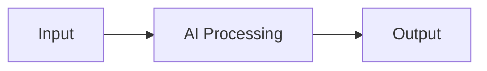
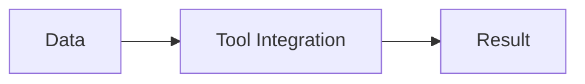
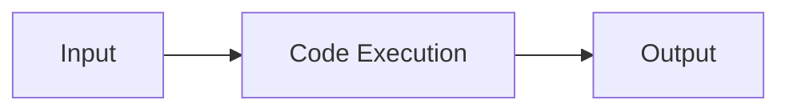
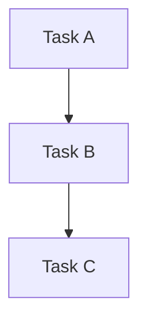

# Core Concepts

## Task Types

### AI Task

Handles intelligent processing using AI capabilities.

### Human Task

Manages human interventions and approvals.

### App Task

Integrates with external tools and applications.

### Coder Task

Executes custom code artifacts.

## Parameter Types

### Input Parameters
Data that flows into tasks:
- Basic types (string, number, boolean)
- Complex types (array, object)
- Special types (artifacts)

### Output Parameters
Results produced by tasks:
- Basic data types
- File outputs
- Media outputs
- Structured data

## Assignment Rules

### Rule Types
1. **Exception**
   - Error handling
   - Special cases

2. **Human Feedback**
   - Approvals
   - Reviews

### Assignment Types
1. **User Assignment**
   - Direct user allocation
   - Individual responsibility

2. **Team Assignment**
   - Group allocation
   - Round-robin distribution

## Workflow Concepts

### Dependencies

- Sequential execution
- Parallel processing
- Conditional flows

### Error Policies
1. **RAISE**
   - Stop execution
   - Report error

2. **IGNORE**
   - Continue execution
   - Log warning

3. **RETRY**
   - Attempt recovery
   - Configurable attempts

## Best Practices Overview

1. **Task Design**
   - Clear naming
   - Proper description
   - Error handling

2. **Parameter Configuration**
   - Type selection
   - Validation rules
   - Default values

3. **Assignment Setup**
   - Clear responsibilities
   - Backup assignees
   - Team distribution

## Next Steps

1. Try the [Quick Start Guide](quickstart.md)
2. Explore [Task Types](../tasks/overview.md)
3. Learn about [Parameters](../parameters/input-parameters.md)