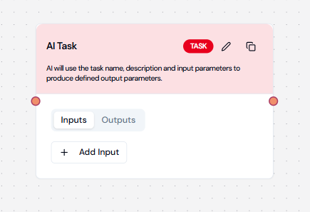
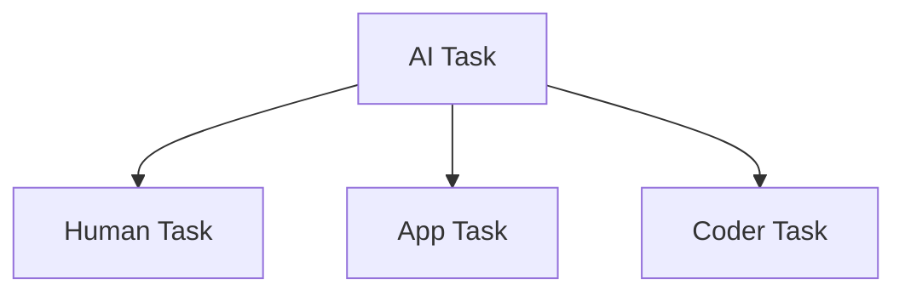

# AI Task

## Overview

AI Tasks are designed for intelligent processing operations using artificial intelligence capabilities. These tasks can
handle complex operations like text analysis, content generation, and data processing.

## Visual Example



## Configuration Structure

```json
{
    "type": "TASK",
    "block": {
        "name": "AI Task Name",
        "type": "TASK",
        "instructions": "Detailed instructions for the AI",
        "input_parameters": [],
        "expected_output": [],
        "dependencies": [],
        "error_policy": "RAISE"
    }
}
```

## Required Fields

| Field            | Type   | Description                       | Required |
| ---------------- | ------ | --------------------------------- | -------- |
| name             | string | Unique identifier for the task    | Yes      |
| instructions     | string | Clear instructions for processing | Yes      |
| input_parameters | array  | Input configuration               | Yes      |
| expected_output  | array  | Output configuration              | Yes      |
| dependencies     | array  | List of dependent tasks           | No       |
| error_policy     | string | Error handling strategy           | No       |

## Input Parameters

### Text Input

```json
{
    "name": "input_text",
    "type": "STRING",
    "description": "Text content to process",
    "required": true,
    "source": "task_config"
}
```

### Structured Data Input

```json
{
    "name": "data_object",
    "type": "OBJECT",
    "description": "Structured data for analysis",
    "properties": [
        {
            "name": "field1",
            "type": "STRING",
            "description": "First field"
        },
        {
            "name": "field2",
            "type": "INTEGER",
            "description": "Second field"
        }
    ]
}
```

### Array Input

```json
{
    "name": "items",
    "type": "ARRAY",
    "description": "List of items to process",
    "items": {
        "type": "STRING"
    }
}
```

## Output Parameters

### Basic Output

```json
{
    "name": "result",
    "type": "STRING",
    "description": "Processing result"
}
```

### Analysis Output

```json
{
    "name": "analysis",
    "type": "OBJECT",
    "properties": {
        "sentiment": {
            "type": "STRING",
            "description": "Detected sentiment"
        },
        "confidence": {
            "type": "FLOAT",
            "description": "Confidence score"
        },
        "categories": {
            "type": "ARRAY",
            "items": {
                "type": "STRING"
            },
            "description": "Detected categories"
        }
    }
}
```

## Common Use Cases

### 1. Text Analysis

```json
{
    "name": "Analyze Text",
    "instructions": "Analyze the input text for sentiment and key topics",
    "input_parameters": [
        {
            "name": "text",
            "type": "STRING",
            "description": "Text to analyze",
            "required": true
        }
    ],
    "expected_output": [
        {
            "name": "analysis",
            "type": "OBJECT",
            "properties": {
                "sentiment": "STRING",
                "topics": "ARRAY",
                "summary": "STRING"
            }
        }
    ]
}
```

### 2. Content Generation

```json
{
    "name": "Generate Content",
    "instructions": "Generate content based on provided parameters",
    "input_parameters": [
        {
            "name": "topic",
            "type": "STRING",
            "description": "Content topic",
            "required": true
        },
        {
            "name": "style",
            "type": "STRING",
            "description": "Writing style",
            "required": true
        },
        {
            "name": "length",
            "type": "INTEGER",
            "description": "Target word count",
            "required": true
        }
    ],
    "expected_output": [
        {
            "name": "content",
            "type": "STRING",
            "description": "Generated content"
        }
    ]
}
```

## Best Practices

### 1. Writing Instructions

✅ **Do**:

-   Be specific and clear
-   Include examples when helpful
-   Specify format requirements
-   Define expected behavior

❌ **Don't**:

-   Use vague descriptions
-   Omit important details
-   Assume context

### 2. Input Configuration

✅ **Do**:

-   Validate input types
-   Set required fields
-   Provide clear descriptions
-   Use appropriate types

❌ **Don't**:

-   Use overly complex structures
-   Skip parameter descriptions
-   Ignore validation

### 3. Output Configuration

✅ **Do**:

-   Define clear structure
-   Include all necessary fields
-   Document format requirements
-   Handle error cases

❌ **Don't**:

-   Use ambiguous types
-   Omit error handling
-   Ignore edge cases

## Error Handling

### Error Policies

```json
{
    "error_policy": "RAISE", // Stop on error
    "error_policy": "IGNORE", // Continue execution
    "error_policy": "RETRY" // Retry on failure
}
```

### Validation

1. Input validation
2. Output validation
3. Error reporting

## Examples

### Text Classification

```json
{
    "name": "Classify Text",
    "instructions": "Classify the input text into predefined categories",
    "input_parameters": [
        {
            "name": "text",
            "type": "STRING",
            "description": "Text to classify",
            "required": true
        },
        {
            "name": "categories",
            "type": "ARRAY",
            "items": {
                "type": "STRING"
            },
            "description": "Available categories",
            "required": true
        }
    ],
    "expected_output": [
        {
            "name": "classification",
            "type": "OBJECT",
            "properties": {
                "category": "STRING",
                "confidence": "FLOAT",
                "alternatives": "ARRAY"
            }
        }
    ]
}
```

## Common Issues and Solutions

| Issue                  | Solution                                     |
| ---------------------- | -------------------------------------------- |
| Unclear Instructions   | Provide specific, detailed instructions      |
| Input Validation Fails | Check input types and requirements           |
| Output Mismatch        | Verify output structure matches requirements |
| Performance Issues     | Optimize input/output size                   |

## Integration with Other Tasks

### Passing Results


