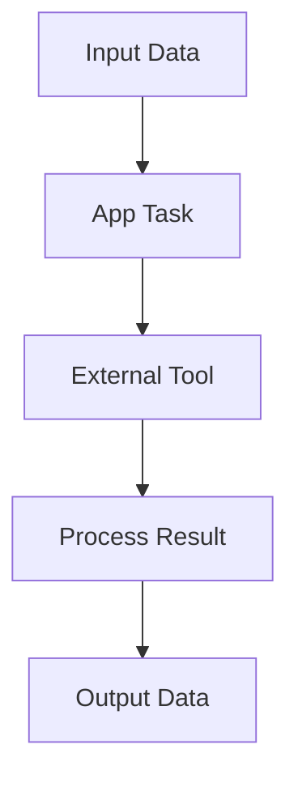

# App Task

## Overview

App Tasks enable integration with external tools and applications in your workflow. These tasks are designed for operations like data processing, file operations, and API integrations.

## Configuration Structure

```json
{
  "type": "APP_TASK",
  "block": {
    "name": "App Task Name",
    "type": "APP_TASK",
    "instructions": "Task instructions",
    "provider": "provider_name",
    "tool_name": "tool_name",
    "tool_id": 123,
    "org_integration_id": null,
    "input_parameters": [],
    "expected_output": [],
    "dependencies": [],
    "error_policy": "RAISE"
  }
}
```

## Required Fields

| Field | Type | Description | Required |
|-------|------|-------------|----------|
| name | string | Task identifier | Yes |
| instructions | string | Task instructions | Yes |
| provider | string | Tool provider | Yes |
| tool_name | string | Name of the tool | Yes |
| tool_id | integer | Tool identifier | Yes |
| org_integration_id | integer | Organization integration ID | No |
| input_parameters | array | Input configuration | Yes |
| expected_output | array | Output configuration | Yes |

## Provider Types

Available providers for App Tasks:
- PDF
- CSV
- Drive
- Code
- Email
- Notion
- Custom

## Input Parameters

### Basic Input
```json
{
  "name": "filename",
  "type": "STRING",
  "description": "Name of the file to process",
  "required": true,
  "source": "task_config"
}
```

### File Content Input
```json
{
  "name": "file_content",
  "type": "STRING",
  "description": "Content to write to file",
  "required": true,
  "source": "task_config"
}
```

### Configuration Input
```json
{
  "name": "settings",
  "type": "OBJECT",
  "description": "Tool configuration settings",
  "properties": [
    {
      "name": "format",
      "type": "STRING",
      "description": "Output format",
      "required": true
    },
    {
      "name": "options",
      "type": "OBJECT",
      "description": "Additional options"
    }
  ]
}
```

## Output Parameters

### File Output
```json
{
  "name": "processed_file",
  "type": "FILE",
  "description": "Processed file output"
}
```

### API Response
```json
{
  "name": "api_response",
  "type": "OBJECT",
  "properties": {
    "status": {
      "type": "STRING",
      "description": "Response status"
    },
    "data": {
      "type": "OBJECT",
      "description": "Response data"
    }
  }
}
```

## Common Use Cases

### 1. PDF Generation
```json
{
  "name": "Generate PDF",
  "provider": "pdf",
  "tool_name": "writer",
  "tool_id": 12,
  "input_parameters": [
    {
      "name": "html_content",
      "type": "STRING",
      "description": "HTML content for PDF",
      "required": true
    },
    {
      "name": "filename",
      "type": "STRING",
      "description": "Output filename",
      "required": true
    }
  ],
  "expected_output": [
    {
      "name": "pdf_url",
      "type": "STRING",
      "description": "URL of generated PDF"
    }
  ]
}
```

### 2. CSV Processing
```json
{
  "name": "Process CSV",
  "provider": "csv",
  "tool_name": "processor",
  "tool_id": 34,
  "input_parameters": [
    {
      "name": "csv_data",
      "type": "ARRAY",
      "description": "CSV data to process",
      "required": true
    }
  ],
  "expected_output": [
    {
      "name": "processed_data",
      "type": "ARRAY",
      "description": "Processed CSV data"
    }
  ]
}
```

## Integration Configuration

### Tool Setup
```json
{
  "provider": "provider_name",
  "tool_name": "tool_name",
  "tool_id": 123,
  "org_integration_id": 456
}
```

### Authentication
```json
{
  "auth_type": "oauth|apikey|basic",
  "credentials": {
    "key": "value"
  }
}
```

## Best Practices

### 1. Tool Selection
✅ **Do**:
- Choose appropriate provider
- Verify tool capabilities
- Check authentication requirements
- Test integration thoroughly

❌ **Don't**:
- Use deprecated tools
- Ignore rate limits
- Skip error handling

### 2. Input Configuration
✅ **Do**:
- Validate input formats
- Document requirements
- Handle file types correctly
- Set appropriate timeouts

❌ **Don't**:
- Skip validation
- Ignore size limits
- Use hardcoded credentials

## Error Handling

### Common Errors
1. Authentication Failures
2. Rate Limiting
3. Invalid Input
4. Network Issues

### Error Policy
```json
{
  "error_policy": "RAISE|IGNORE|RETRY",
  "max_retries": 3,
  "retry_delay": 60
}
```

## Provider-Specific Examples

### PDF Provider
```json
{
  "provider": "pdf",
  "tool_name": "writer",
  "input_parameters": [
    {
      "name": "template",
      "type": "STRING",
      "description": "PDF template"
    },
    {
      "name": "data",
      "type": "OBJECT",
      "description": "Template data"
    }
  ]
}
```

### Drive Provider
```json
{
  "provider": "drive",
  "tool_name": "file_manager",
  "input_parameters": [
    {
      "name": "file_id",
      "type": "STRING",
      "description": "Drive file ID"
    }
  ]
}
```

## Integration Flow



## Common Issues and Solutions

| Issue | Solution |
|-------|----------|
| Authentication Failed | Verify credentials and permissions |
| Rate Limit Exceeded | Implement backoff strategy |
| Invalid Input Format | Validate input before processing |
| Tool Unavailable | Check tool status and fallback |

## Next Steps

1. Learn about [Coder Tasks](coder-task.md)
2. Review [Validation Rules](../guides/validation-rules.md)
3. Check [Best Practices](../guides/best-practices.md)

## Related Documentation

- [Tool Integration](../guides/tool-integration.md)
- [Authentication](../guides/authentication.md)
- [Error Handling](../guides/error-handling.md)