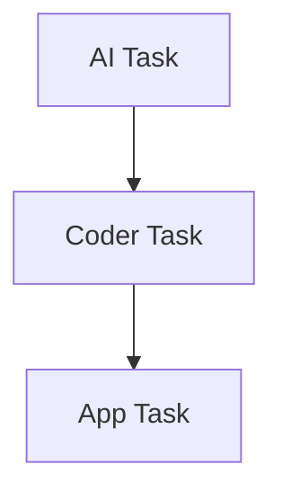
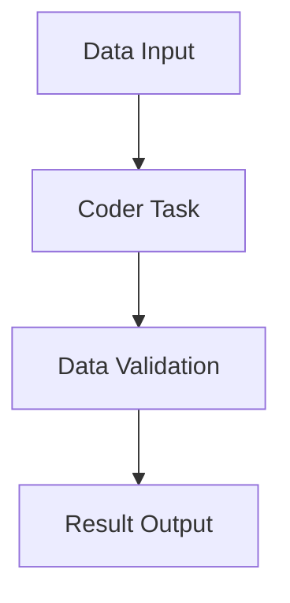

# Coder Task

## Overview

Coder Tasks allow you to execute pre-defined code artifacts within your workflow. These tasks are ideal for custom calculations, data transformations, and complex business logic implementation.

## Configuration Structure

```json
{
  "type": "CODER",
  "block": {
    "name": "Coder Task Name",
    "type": "CODER",
    "instructions": "Task instructions",
    "code_artifact_id": 123,
    "input_parameters": [],
    "expected_output": [],
    "dependencies": [],
    "error_policy": "RAISE"
  }
}
```

## Required Fields

| Field | Type | Description | Required |
|-------|------|-------------|----------|
| name | string | Task identifier | Yes |
| instructions | string | Task instructions | Yes |
| code_artifact_id | integer | Reference to code artifact | Yes |
| input_parameters | array | Input configuration | Yes |
| expected_output | array | Output configuration | Yes |
| dependencies | array | Task dependencies | No |
| error_policy | string | Error handling strategy | No |

## Input Parameters

### Basic Input
```json
{
  "name": "data",
  "type": "STRING",
  "description": "Input data for processing",
  "required": true,
  "source": "task_config"
}
```

### Complex Input
```json
{
  "name": "config",
  "type": "OBJECT",
  "description": "Configuration object",
  "properties": [
    {
      "name": "algorithm",
      "type": "STRING",
      "description": "Algorithm selection",
      "required": true
    },
    {
      "name": "parameters",
      "type": "OBJECT",
      "description": "Algorithm parameters",
      "properties": [
        {
          "name": "iterations",
          "type": "INTEGER",
          "description": "Number of iterations",
          "required": true
        }
      ]
    }
  ]
}
```

## Output Parameters

### Simple Output
```json
{
  "name": "result",
  "type": "STRING",
  "description": "Processing result"
}
```

### Complex Output
```json
{
  "name": "analysis_result",
  "type": "OBJECT",
  "properties": {
    "result": {
      "type": "FLOAT",
      "description": "Calculated value"
    },
    "metadata": {
      "type": "OBJECT",
      "description": "Processing metadata"
    },
    "logs": {
      "type": "ARRAY",
      "items": {
        "type": "STRING"
      },
      "description": "Processing logs"
    }
  }
}
```

## Common Use Cases

### 1. Data Transformation
```json
{
  "name": "Transform Data",
  "code_artifact_id": 123,
  "instructions": "Transform input data according to specified rules",
  "input_parameters": [
    {
      "name": "data",
      "type": "OBJECT",
      "description": "Raw data object",
      "required": true
    },
    {
      "name": "transformation_rules",
      "type": "ARRAY",
      "description": "Transformation rules",
      "required": true
    }
  ],
  "expected_output": [
    {
      "name": "transformed_data",
      "type": "OBJECT",
      "description": "Transformed data"
    }
  ]
}
```

### 2. Custom Calculation
```json
{
  "name": "Calculate Metrics",
  "code_artifact_id": 456,
  "instructions": "Calculate custom business metrics",
  "input_parameters": [
    {
      "name": "raw_metrics",
      "type": "ARRAY",
      "description": "Raw metric data",
      "required": true
    }
  ],
  "expected_output": [
    {
      "name": "calculated_metrics",
      "type": "OBJECT",
      "properties": {
        "kpi1": "FLOAT",
        "kpi2": "FLOAT",
        "summary": "STRING"
      }
    }
  ]
}
```

## Best Practices

### 1. Code Artifact Management
✅ **Do**:
- Use version control
- Document dependencies
- Include test cases
- Handle errors gracefully

❌ **Don't**:
- Hard-code configurations
- Ignore error cases
- Skip input validation
- Mix business logic

### 2. Input Parameters
✅ **Do**:
- Validate all inputs
- Document requirements
- Use appropriate types
- Include examples

❌ **Don't**:
- Skip validation
- Use ambiguous names
- Ignore data types

### 3. Output Handling
✅ **Do**:
- Define clear structure
- Include error info
- Add processing metadata
- Validate outputs

❌ **Don't**:
- Return raw errors
- Skip validation
- Use inconsistent formats

## Error Handling

### Configuration
```json
{
  "error_policy": "RAISE",
  "retry_count": 3,
  "retry_delay": 60
}
```

### Error Types
1. Input Validation Errors
2. Processing Errors
3. System Errors

## Integration Examples

### With AI Task


### With Data Processing


## Common Issues and Solutions

| Issue | Solution |
|-------|----------|
| Code Artifact Not Found | Verify artifact ID and access |
| Input Validation Failed | Check input types and format |
| Processing Error | Review error logs and retry |
| Memory Issues | Optimize data handling |

## Examples by Industry

### Finance
```json
{
  "name": "Risk Calculator",
  "code_artifact_id": 789,
  "instructions": "Calculate investment risk metrics",
  "input_parameters": [
    {
      "name": "portfolio_data",
      "type": "OBJECT",
      "description": "Portfolio information",
      "required": true
    }
  ],
  "expected_output": [
    {
      "name": "risk_metrics",
      "type": "OBJECT",
      "properties": {
        "var": "FLOAT",
        "sharpe_ratio": "FLOAT",
        "risk_level": "STRING"
      }
    }
  ]
}
```

## Next Steps

1. Learn about [App Tasks](app-task.md)
2. Review [Validation Rules](../guides/validation-rules.md)
3. Check [Best Practices](../guides/best-practices.md)

## Related Documentation

- [Code Artifacts](../guides/code-artifacts.md)
- [Error Handling](../guides/error-handling.md)
- [Performance Optimization](../guides/performance.md)
