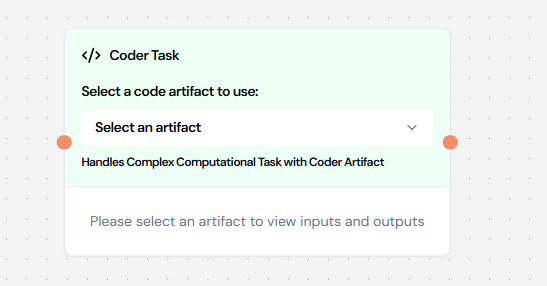
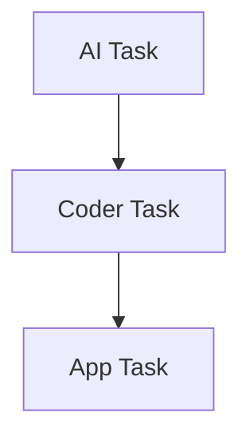
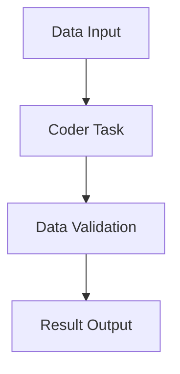

# 💻 Coder Task

## Overview

Coder Tasks allow you to execute pre-defined code artifacts within your workflow. These tasks integrate the
computational power of [Coder Artifacts](../knowledge/coder-artifact.md) into your workflow processes. Coder Tasks are
ideal for custom calculations, data transformations, and complex business logic implementation.

## Visual Example



## Configuration Structure

```json
{
    "type": "CODER",
    "block": {
        "name": "Coder Task Name",
        "type": "CODER",
        "instructions": "Task instructions",
        "code_artifact_id": 123,
        "input_parameters": [],
        "expected_output": [],
        "dependencies": [],
        "error_policy": "RAISE"
    }
}
```

## Required Fields

| Field            | Type    | Description                | Required |
| :--------------- | :------ | :------------------------- | :------: |
| name             | string  | Task identifier            |    ✅    |
| instructions     | string  | Task instructions          |    ✅    |
| code_artifact_id | integer | Reference to code artifact |    ✅    |
| input_parameters | array   | Input configuration        |    ✅    |
| expected_output  | array   | Output configuration       |    ✅    |
| dependencies     | array   | Task dependencies          |    ❌    |
| error_policy     | string  | Error handling strategy    |    ❌    |

## Input Parameters

The input parameters define what data your Coder Task will receive. These parameters will be passed to the `arguments`
dictionary in your [Coder Artifact](../knowledge/coder-artifact.md) function.

### Basic Input

```json
{
    "name": "data",
    "type": "STRING",
    "description": "Input data for processing",
    "required": true,
    "source": "task_config"
}
```

### Complex Input

```json
{
    "name": "config",
    "type": "OBJECT",
    "description": "Configuration object",
    "properties": [
        {
            "name": "algorithm",
            "type": "STRING",
            "description": "Algorithm selection",
            "required": true
        },
        {
            "name": "parameters",
            "type": "OBJECT",
            "description": "Algorithm parameters",
            "properties": [
                {
                    "name": "iterations",
                    "type": "INTEGER",
                    "description": "Number of iterations",
                    "required": true
                }
            ]
        }
    ]
}
```

## Output Parameters

Output parameters define the structure of data that your Coder Task will return. These should match the structure
returned by your [Coder Artifact](../knowledge/coder-artifact.md) function.

### Simple Output

```json
{
    "name": "result",
    "type": "STRING",
    "description": "Processing result"
}
```

### Complex Output

```json
{
    "name": "analysis_result",
    "type": "OBJECT",
    "properties": {
        "result": {
            "type": "FLOAT",
            "description": "Calculated value"
        },
        "metadata": {
            "type": "OBJECT",
            "description": "Processing metadata"
        },
        "logs": {
            "type": "ARRAY",
            "items": {
                "type": "STRING"
            },
            "description": "Processing logs"
        }
    }
}
```

## Workflow Integration

Coder Tasks act as computational nodes in your workflow, taking input from previous tasks, processing it using the
referenced Coder Artifact, and outputting results for subsequent tasks.

## Common Use Cases

### 1. Data Transformation

```json
{
    "name": "Transform Data",
    "code_artifact_id": 123,
    "instructions": "Transform input data according to specified rules",
    "input_parameters": [
        {
            "name": "data",
            "type": "OBJECT",
            "description": "Raw data object",
            "required": true
        },
        {
            "name": "transformation_rules",
            "type": "ARRAY",
            "description": "Transformation rules",
            "required": true
        }
    ],
    "expected_output": [
        {
            "name": "transformed_data",
            "type": "OBJECT",
            "description": "Transformed data"
        }
    ]
}
```

### 2. Custom Calculation

```json
{
    "name": "Calculate Metrics",
    "code_artifact_id": 456,
    "instructions": "Calculate custom business metrics",
    "input_parameters": [
        {
            "name": "raw_metrics",
            "type": "ARRAY",
            "description": "Raw metric data",
            "required": true
        }
    ],
    "expected_output": [
        {
            "name": "calculated_metrics",
            "type": "OBJECT",
            "properties": {
                "kpi1": "FLOAT",
                "kpi2": "FLOAT",
                "summary": "STRING"
            }
        }
    ]
}
```

### 3. Invoice Processing

```json
{
    "name": "Calculate Invoice Information",
    "code_artifact_id": 789,
    "instructions": "Compute the total invoice amount based on the collected item details",
    "input_parameters": [
        {
            "name": "items_to_be_billed",
            "type": "ARRAY",
            "items": {
                "type": "OBJECT",
                "properties": {
                    "item_price": { "type": "STRING" },
                    "item_quantity": { "type": "STRING" }
                }
            },
            "description": "List of items with price and quantity",
            "required": true
        }
    ],
    "expected_output": [
        {
            "name": "calculation_amount",
            "type": "OBJECT",
            "properties": {
                "total_tax": { "type": "STRING" },
                "current_date": { "type": "STRING" },
                "total_amount": { "type": "STRING" },
                "total_state_tax": { "type": "STRING" },
                "total_central_tax": { "type": "STRING" },
                "total_amount_with_gst": { "type": "STRING" }
            },
            "description": "Calculated invoice amounts"
        }
    ]
}
```

## Best Practices

### 1. Code Artifact Management

✅ **Do**:

-   Use version control for your Coder Artifacts
-   Document dependencies clearly
-   Include test cases with your Coder Artifacts
-   Handle errors gracefully in your Python code (as shown in the
    [Coder Artifact documentation](../knowledge/coder-artifact.md))

❌ **Don't**:

-   Hard-code configurations that might change
-   Ignore error cases in your Coder Artifact code
-   Skip input validation in your Python function
-   Mix business logic between Coder Tasks and Coder Artifacts

### 2. Input Parameters

✅ **Do**:

-   Validate all inputs in your Coder Artifact code
-   Document input requirements thoroughly
-   Use appropriate types that match your Coder Artifact expectations
-   Include examples in your documentation

❌ **Don't**:

-   Skip validation in your Coder Artifact code
-   Use ambiguous parameter names
-   Ignore data types that will cause conversion issues

### 3. Output Handling

✅ **Do**:

-   Define clear output structure that matches your Coder Artifact return values
-   Include error information in your response
-   Add processing metadata when useful
-   Validate outputs in your Coder Artifact code

❌ **Don't**:

-   Return raw errors without context
-   Skip validation of output data
-   Use inconsistent formats between Coder Artifact and Coder Task configurations

## ⚠️ Error Handling

### Configuration

```json
{
    "error_policy": "RAISE",
    "retry_count": 3,
    "retry_delay": 60
}
```

### Error Types

1. **Input Validation Errors**: Occurs when input doesn't match expected format
2. **Processing Errors**: Occurs during execution of the Coder Artifact
3. **System Errors**: Occurs due to system limitations or failures

## 🔗 Integration Examples

### With AI Task



### With Data Processing



## ❓ Common Issues and Solutions

| Issue                   | Solution                                                         |
| :---------------------- | :--------------------------------------------------------------- |
| Code Artifact Not Found | Verify artifact ID and ensure it's published                     |
| Input Validation Failed | Check input types and format against Coder Artifact requirements |
| Processing Error        | Review error logs in your Coder Artifact and retry               |
| Memory Issues           | Optimize data handling in your Python code                       |

## 🏢 Examples by Industry

### Finance

```json
{
    "name": "Risk Calculator",
    "code_artifact_id": 789,
    "instructions": "Calculate investment risk metrics",
    "input_parameters": [
        {
            "name": "portfolio_data",
            "type": "OBJECT",
            "description": "Portfolio information",
            "required": true
        }
    ],
    "expected_output": [
        {
            "name": "risk_metrics",
            "type": "OBJECT",
            "properties": {
                "var": "FLOAT",
                "sharpe_ratio": "FLOAT",
                "risk_level": "STRING"
            }
        }
    ]
}
```

## 🔄 Connection with Coder Artifacts

Coder Tasks rely on well-designed Coder Artifacts to function properly. When creating a Coder Task:

1. **Select an existing Coder Artifact** from your knowledge base
2. **Configure input parameters** that match the expectations of your Coder Artifact's function
3. **Define expected output** that aligns with what your Coder Artifact function returns
4. **Provide clear instructions** for maintainers to understand the task's purpose

For detailed information on creating effective Coder Artifacts, refer to the
[Coder Artifact documentation](../knowledge/coder-artifact.md).
