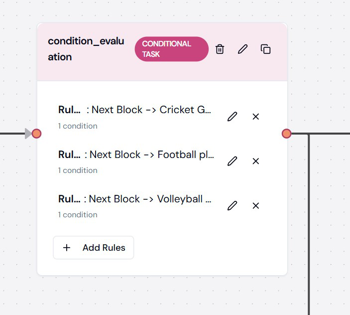
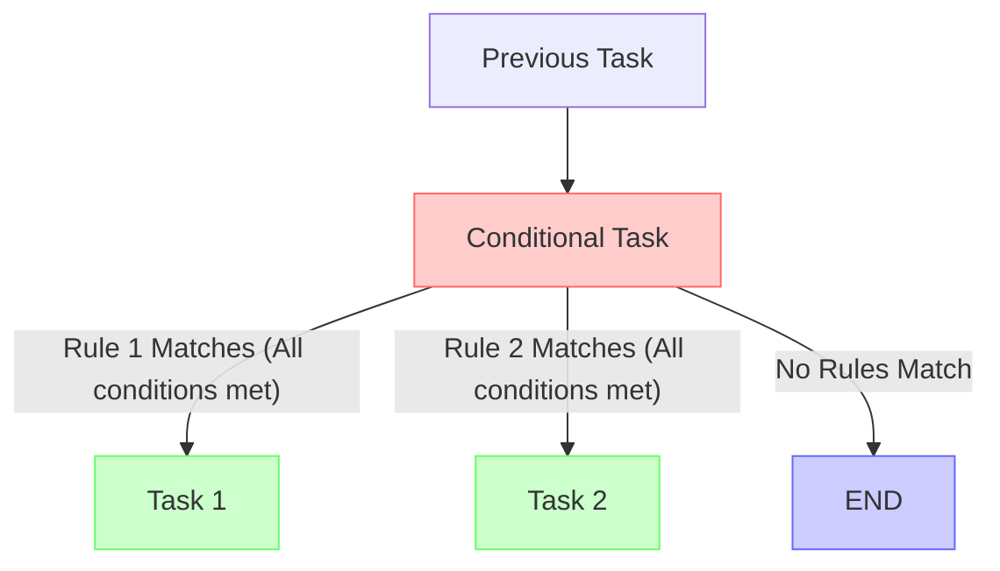

# Conditional Task

## Overview

Conditional Tasks enable workflow branching based on defined rules and conditions. Each rule evaluates output parameters from previous tasks, allowing for dynamic workflow execution paths. This feature lets you create intelligent workflows that respond to data variations and task outcomes.

## Visual Example



## Configuration Structure

```json
{
    "type": "CONDITIONAL_TASK",
    "block": {
        "name": "Route Customer Request",
        "type": "CONDITIONAL_TASK",
        "rules": [
            {
                "conditions": [
                    {
                        "task": "Analyze Request",
                        "parameter": "sentiment_score",
                        "parameter_type": "FLOAT",
                        "operator": "LESS_THAN",
                        "value": "0.3"
                    },
                    {
                        "task": "Analyze Request",
                        "parameter": "urgency",
                        "parameter_type": "STRING",
                        "operator": "EQUAL",
                        "value": "high"
                    }
                ],
                "then_block": "Escalate Request"
            },
            {
                "conditions": [
                    {
                        "task": "Analyze Request",
                        "parameter": "category",
                        "parameter_type": "STRING",
                        "operator": "EQUAL",
                        "value": "refund"
                    }
                ],
                "then_block": "Process Refund"
            }
        ],
        "dependencies": ["Analyze Request"],
        "error_policy": "RAISE"
    }
}
```

## Required Fields

| Field        | Type   | Description                             | Required |
| ------------ | ------ | --------------------------------------- | -------- |
| name         | string | Task identifier                         | Yes      |
| rules        | array  | Array of condition rules                | Yes      |
| dependencies | array  | Task dependencies                       | No       |
| error_policy | string | Error handling strategy                 | No       |

## Rules Configuration

Each conditional task must have one or more rules. Rules are evaluated in the order they appear in the configuration.

```json
{
    "rules": [
        {
            "conditions": [...],
            "then_block": "Task ID"
        }
    ]
}
```

### Rule Structure

Each rule contains:

- **conditions**: Array of conditions that must ALL be satisfied (AND operation)
- **then_block**: The task to execute if all conditions are met (defaults to "END" if not specified)

## Condition Configuration

```json
{
    "conditions": [
        {
            "task": "Previous Task Name",
            "parameter": "output_parameter_name",
            "parameter_type": "STRING",
            "operator": "EQUAL",
            "value": "expected_value"
        }
    ]
}
```

### Condition Fields

| Field          | Type   | Description                                          | Required |
| -------------- | ------ | ---------------------------------------------------- | -------- |
| task           | string | Source task (must be a dependency)                   | Yes      |
| parameter      | string | Output parameter from the source task                | Yes      |
| parameter_type | enum   | Data type of the parameter                           | Yes      |
| operator       | enum   | Comparison operator                                  | Yes      |
| value          | any    | Value to compare against                             | Yes*     |

\* Not required for operators like IS_NULL, IS_NOT_NULL, IS_EMPTY, IS_NOT_EMPTY

### Parameter Types

The following parameter types are supported:

| Type     | Description                           | Example Values                   |
| -------- | ------------------------------------- | -------------------------------- |
| STRING   | Text values                           | "approval", "high", "rejected"   |
| INTEGER  | Whole numbers                         | 1, 42, -10                       |
| FLOAT    | Decimal numbers                       | 0.5, 3.14, -2.5                  |
| BOOLEAN  | True/false values                     | true, false                      |
| DATETIME | Date and time values                  | "2024-03-15 14:30:00"           |
| ARRAY    | Lists of values                       | [1, 2, 3], ["red", "green"]     |
| ENUM     | Predefined set of values              | "APPROVED", "REJECTED"           |

### Available Operators

The available operators depend on the data type of the selected parameter:

#### String Operators

- `EQUAL`: Exact match
- `NOT_EQUAL`: Not an exact match
- `CONTAINS`: String contains value
- `STARTS_WITH`: String starts with value
- `ENDS_WITH`: String ends with value
- `IS_NULL`: Value is null
- `IS_NOT_NULL`: Value is not null

#### Numeric Operators (INTEGER, FLOAT)

- `EQUAL`: Equal to
- `NOT_EQUAL`: Not equal to
- `GREATER_THAN`: Greater than
- `LESS_THAN`: Less than
- `GREATER_THAN_OR_EQUAL`: Greater than or equal to
- `LESS_THAN_OR_EQUAL`: Less than or equal to
- `IS_NULL`: Value is null
- `IS_NOT_NULL`: Value is not null

#### Boolean Operators

- `EQUAL`: Equal to (true/false)
- `NOT_EQUAL`: Not equal to (true/false)
- `IS_NULL`: Value is null
- `IS_NOT_NULL`: Value is not null

#### DateTime Operators

- `EQUAL`: Equal to
- `NOT_EQUAL`: Not equal to
- `GREATER_THAN`: Later than
- `LESS_THAN`: Earlier than
- `GREATER_THAN_OR_EQUAL`: Later than or equal to
- `LESS_THAN_OR_EQUAL`: Earlier than or equal to
- `IS_NULL`: Value is null
- `IS_NOT_NULL`: Value is not null

#### Array Operators

- `IS_EMPTY`: Array has no elements
- `IS_NOT_EMPTY`: Array has at least one element

#### Enum Operators

- `EQUAL`: Exact match
- `NOT_EQUAL`: Not an exact match

## Then Block Configuration

The `then_block` field specifies which task to execute if all conditions in the rule are satisfied.

```json
{
    "then_block": "Next Task Name"
}
```

- If no `then_block` is specified, or if it is set to "END", the workflow will terminate
- Only tasks that have been connected to the conditional task in the workflow editor will appear in the dropdown

## Common Use Cases

### 1. Content Routing

```json
{
    "name": "Route Content",
    "rules": [
        {
            "conditions": [
                {
                    "task": "Analyze Content",
                    "parameter": "toxicity_score",
                    "parameter_type": "FLOAT",
                    "operator": "GREATER_THAN",
                    "value": "0.7"
                }
            ],
            "then_block": "Human Review"
        },
        {
            "conditions": [
                {
                    "task": "Analyze Content",
                    "parameter": "toxicity_score",
                    "parameter_type": "FLOAT",
                    "operator": "LESS_THAN",
                    "value": "0.2"
                }
            ],
            "then_block": "Publish Content"
        }
    ],
    "dependencies": ["Analyze Content"],
    "error_policy": "RAISE"
}
```

### 2. Customer Support Triage

```json
{
    "name": "Triage Support Request",
    "rules": [
        {
            "conditions": [
                {
                    "task": "Classify Request",
                    "parameter": "priority",
                    "parameter_type": "STRING",
                    "operator": "EQUAL",
                    "value": "high"
                }
            ],
            "then_block": "Urgent Support"
        },
        {
            "conditions": [
                {
                    "task": "Classify Request",
                    "parameter": "category",
                    "parameter_type": "STRING",
                    "operator": "EQUAL",
                    "value": "billing"
                }
            ],
            "then_block": "Billing Department"
        }
    ],
    "dependencies": ["Classify Request"],
    "error_policy": "RAISE"
}
```

### 3. Data Validation

```json
{
    "name": "Validate Data",
    "rules": [
        {
            "conditions": [
                {
                    "task": "Extract Data",
                    "parameter": "records",
                    "parameter_type": "ARRAY",
                    "operator": "IS_EMPTY"
                }
            ],
            "then_block": "Handle Empty Dataset"
        },
        {
            "conditions": [
                {
                    "task": "Extract Data",
                    "parameter": "validation_score",
                    "parameter_type": "FLOAT",
                    "operator": "LESS_THAN",
                    "value": "0.8"
                }
            ],
            "then_block": "Clean Data"
        }
    ],
    "dependencies": ["Extract Data"],
    "error_policy": "RAISE"
}
```

## Task Flow



## Error Policies

The `error_policy` field defines how errors are handled during rule evaluation:

| Policy | Description                                           |
| ------ | ----------------------------------------------------- |
| RAISE  | Stop workflow execution and raise an error (default)  |
| RETRY  | Retry the condition evaluation after a delay          |
| SKIP   | Skip the failing condition and continue evaluation    |

```json
{
    "error_policy": "RETRY",
    "retry_count": 3,
    "retry_delay": 5
}
```

## Best Practices

### 1. Rule Organization

✅ **Do**:

- Order rules from most specific to most general
- Group related conditions
- Use descriptive names for tasks and parameters
- Test rule evaluation with sample data

❌ **Don't**:

- Create overlapping rules without clear precedence
- Use complex nested conditions when simpler rules would work
- Add unnecessary conditions
- Create circular dependencies

### 2. Condition Design

✅ **Do**:

- Use appropriate operators for each data type
- Validate input values
- Consider edge cases
- Keep conditions simple and clear

❌ **Don't**:

- Mix data types in comparisons
- Use hardcoded values that may change
- Create impossible conditions
- Overcomplicate conditions

### 3. Workflow Integration

✅ **Do**:

- Ensure all referenced tasks exist in the workflow
- Verify parameter names and types
- Use clear task names for easy reference
- Document rule logic for other users

❌ **Don't**:

- Reference tasks outside the workflow
- Use parameters that may not exist
- Create dead-end paths
- Assume parameters will always have values

## Common Issues and Solutions

| Issue                      | Solution                                            |
| -------------------------- | --------------------------------------------------- |
| Rules Never Match          | Check condition values and operators                |
| Wrong Branch Selected      | Review rule order and specificity                   |
| Missing Parameters         | Verify task dependencies and output structure       |
| Type Errors                | Ensure parameter values match expected data types   |
| Workflow Dead Ends         | Connect all possible branches to appropriate tasks  |
| Parameter Changed          | Update conditions if output parameter names change  |
| No Next Node Options       | Connect edges to destination nodes in the workflow  |

## Related Documentation

- [Workflow Tasks](../guides/workflow-tasks.md)
- [Task Dependencies](../guides/task-dependencies.md)
- [Error Handling](../guides/error-handling.md)
