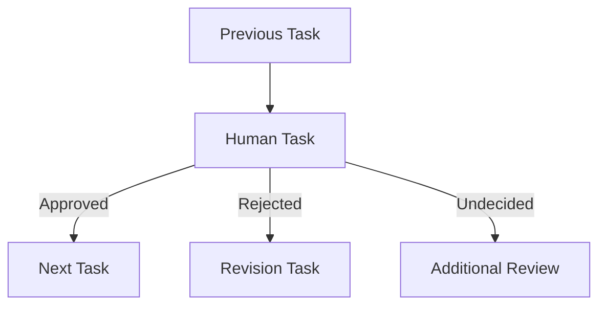

# Human Task

## Overview

Human Tasks are designed for workflows that require human intervention, such as approvals, reviews, or decision-making.
These tasks pause the workflow execution until human input is received.

## Visual Example


## Configuration Structure

```json
{
    "type": "HUMAN_TASK",
    "block": {
        "name": "Human Task Name",
        "type": "HUMAN_TASK",
        "instructions": "Based on the given message, categorize the message into APPROVED or REJECTED or UNDECIDED",
        "dependencies": [],
        "error_policy": "RAISE",
        "assignment_type": "USER", // Required: USER or TEAM
        "assignee_id": "user_id", // Required: User ID or Team ID based on assignment_type
        "assignment_logic": "Round_Robin" // Required only when assignment_type is TEAM
    }
}
```

## Required Fields

| Field        | Type   | Description             | Required |
| ------------ | ------ | ----------------------- | -------- |
| name         | string | Task identifier         | Yes      |
| instructions | string | Task instructions       | Yes      |
| dependencies | array  | Task dependencies       | No       |
| error_policy | string | Error handling strategy | No       |

## Task Instructions

Human tasks require clear instructions for the assigned user or team. Instructions should:

- Be specific and clear
- Define expected actions
- Provide decision criteria
- Include any relevant context

Example:

```json
{
    "instructions": "Review the generated content for accuracy and alignment with brand guidelines. Choose APPROVE if content meets all criteria, REJECT if changes are needed, or UNDECIDED if further review is required."
}
```

## Assignment Rules (Required)

When creating a Human Task, you **must** configure an assignment rule to specify who will be responsible for completing
the task. Without a valid assignment rule, you will not be able to create or update the workflow.

### Assignment Configuration

```json
{
    "rule_type": "Human Feedback",
    "assignment_type": "USER|TEAM", // Required: Must be either USER or TEAM
    "assignee_id": "id", // Required: User ID or Team ID based on assignment_type
    "assignment_logic": "Round_Robin|LRU" // Required only when assignment_type is TEAM
}
```

### User Assignment

When assigning to an individual user, select "USER" as the assignment type and choose from the dropdown list of users in
your organization.

```json
{
    "rule_type": "Human Feedback",
    "assignment_type": "USER",
    "assignee_id": "user_id" // Selected from organization user list
}
```

### Team Assignment

When assigning to a team, select "TEAM" as the assignment type, choose a team from the dropdown list, and specify an
assignment logic.

```json
{
    "rule_type": "Human Feedback",
    "assignment_type": "TEAM",
    "assignee_id": "team_id", // Selected from organization team list
    "assignment_logic": "Round_Robin" // Must specify either Round_Robin or LRU
}
```

#### Assignment Logic Options

- **Round_Robin**: Distributes tasks evenly among team members in a circular sequence
- **LRU (Least Recently Used)**: Assigns task to the team member who has not been assigned a task for the longest time

> **Important Note**: If assignment rule conditions are not properly configured, you will not be able to create or
> update the workflow. All required fields must be completed with valid values.

## Common Use Cases

### 1. Document Approval

```json
{
    "name": "Review Document",
    "instructions": "Review the attached document and approve or reject based on compliance guidelines",
    "dependencies": ["Generate Document"]
}
```

### 2. Content Review

```json
{
    "name": "Review Content",
    "instructions": "Review the AI-generated content for accuracy and brand voice. Provide feedback if changes are needed.",
    "dependencies": ["Generate Content"]
}
```

### 3. Decision Making

```json
{
    "name": "Process Decision",
    "instructions": "Review the analysis results and decide on the next steps. Choose APPROVE to proceed or REJECT to revise.",
    "dependencies": ["Analyze Data"]
}
```

## Task Flow



## Response Types

Human tasks can have three possible responses:

1. **APPROVED**: Task approved, workflow continues
2. **REJECTED**: Task rejected, requires revision
3. **UNDECIDED**: Additional review needed

## Best Practices

### 1. Instructions

✅ **Do**:

- Write clear, concise instructions
- Specify decision criteria
- Include relevant context
- Define expected outcomes

❌ **Don't**:

- Use technical jargon
- Write vague instructions
- Omit important details
- Assume knowledge

### 2. Assignment Rules

✅ **Do**:

- Set appropriate assignees
- Configure backup assignments
- Use team assignments for shared tasks
- Set reasonable deadlines
- Verify all required fields are completed

❌ **Don't**:

- Assign to inactive users
- Skip backup assignments
- Ignore time zones
- Use overly complex rules
- Leave assignment rules incomplete

### 3. Dependencies

✅ **Do**:

- Clearly define prerequisites
- Verify data availability
- Set proper task order
- Handle all outcomes

❌ **Don't**:

- Create circular dependencies
- Skip validation
- Ignore error cases

## Error Handling

### Configuration

```json
{
    "error_policy": "RAISE",
    "notification_channels": ["email", "slack"],
    "escalation_after": 24 // hours
}
```

### Common Scenarios

1. **Timeout**

    - Task not completed within deadline
    - Automatic escalation

2. **Assignee Unavailable**

    - Automatic reassignment
    - Backup assignee notification

3. **Invalid Response**
    - Validation error
    - Request for correction

## Integration Examples

### With AI Task

```json
{
    "name": "Review AI Output",
    "instructions": "Review the AI-generated content for accuracy",
    "dependencies": ["Generate AI Content"]
}
```

### With App Task

```json
{
    "name": "Approve Document",
    "instructions": "Review and approve the generated document",
    "dependencies": ["Generate PDF"]
}
```

## Notifications

### Assignment Notification

```json
{
    "channel": "email",
    "template": "task_assignment",
    "data": {
        "task_name": "Document Review",
        "instructions": "...",
        "deadline": "2024-02-24T15:00:00Z"
    }
}
```

### Reminder Notification

```json
{
    "channel": "slack",
    "template": "task_reminder",
    "data": {
        "task_name": "Content Review",
        "time_remaining": "2 hours"
    }
}
```

## Common Issues and Solutions

| Issue                    | Solution                                       |
| ------------------------ | ---------------------------------------------- |
| Missed Deadlines         | Set up reminders and escalations               |
| Unclear Instructions     | Review and clarify task requirements           |
| Assignment Conflicts     | Configure backup assignments                   |
| Response Delays          | Implement notification system                  |
| Invalid Assignment Rules | Ensure all required fields are properly filled |

## Related Documentation

-[Assignment Rules](../guides/assignment-rules.md)
