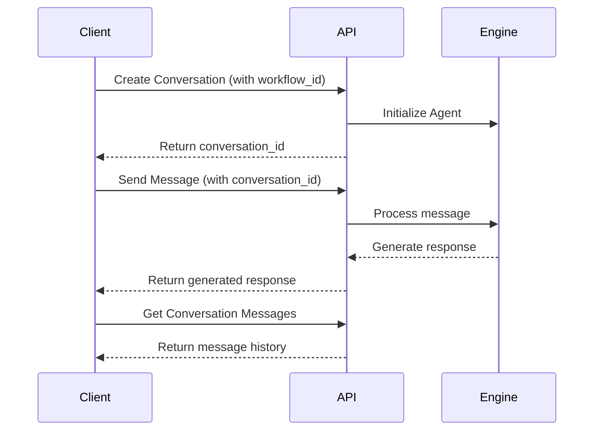

# Chat System Overview

The chat system provides a RESTful API for managing conversations and messages. It's designed to handle normal
conversations and workflow-based conversations through a simple API interface.

## Core Components

### 1. Conversations

-   Create and manage chat sessions
-   Associate conversations with specific workflows
-   Support different usecases
    -   `DEFAULT`: Simple chat conversation
    -   `WORKFLOW_EXECUTION`: To trigger a workflow
-   Track conversation metadata and state

### 2. Messages

-   Send and receive messages within conversations
-   Support text content, media content
-   Track message status and metadata
-   Associate messages with conversations

## Typical Flow Diagram

## Key Features

1. **Workflow Integration**

    - Each conversation can be linked to a specific workflow
    - Supports workflow execution
    - Automatic workflow state management

2. **Message Handling**

    - Synchronous message processing
    - Message status tracking
    - Support for metadata

3. **Error Handling**

    - Consistent error responses
    - Clear status codes
    - Detailed error messages

4. **Webhook Integration**
    - Real-time callback for message events
    - Detailed message information in webhook payload
    - Supports different webhook handlers
